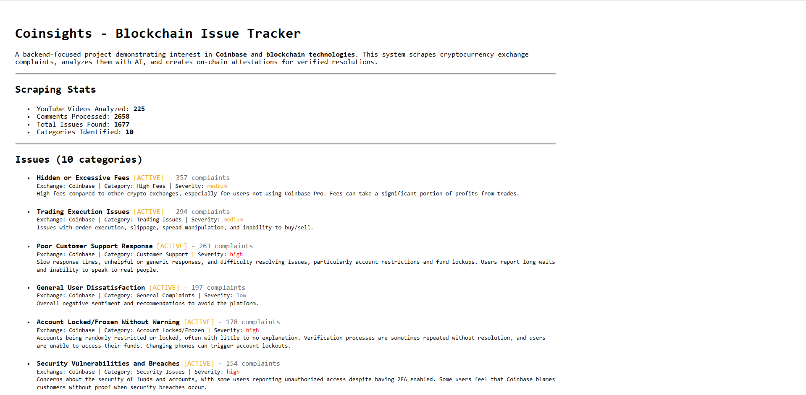
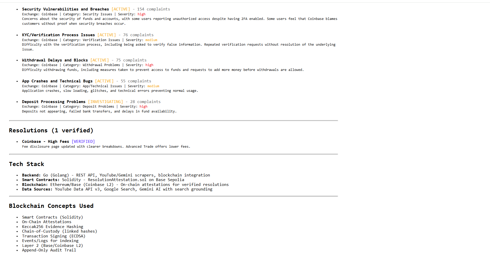

# 🪙 Coinsights

**Backend-Focused Cryptocurrency Exchange Complaint Analyzer with On-Chain Verification**

> A project demonstrating deep interest in **Coinbase** and **blockchain technologies** through a backend-heavy implementation featuring Go APIs, Solidity smart contracts, and on-chain attestations on Base (Coinbase's L2).

---

## 🎨 Logo


---

## 📸 Demo





---

## 🎯 Project Overview

Coinsights is a comprehensive system that:

1. **Scrapes** user complaints about cryptocurrency exchanges (primarily Coinbase) from YouTube videos, comments, Reddit, and news articles
2. **Analyzes** the data using Google's Gemini AI with search grounding to categorize and understand complaint patterns
3. **Tracks** issues by category with severity ratings and complaint counts
4. **Verifies** resolutions through evidence collection and confidence scoring
5. **Records** verified resolutions on-chain using smart contracts for immutable, tamper-proof attestations

This is a **backend-focused** project - the frontend is intentionally minimal (plain text display) to highlight the Go backend, blockchain integration, and smart contract work.

---

## 🚀 Features

### Data Collection
- **YouTube Scraping** - Searches for complaint videos and extracts comments using YouTube Data API v3
- **Gemini AI Search** - Uses Google's Gemini AI with search grounding to find complaints from:
  - Reddit discussions
  - News articles (Trustpilot, BBB, Consumer Reports)
  - YouTube video content analysis

### Analysis & Categorization
- **Keyword-based categorization** into issue types (fees, support, security, etc.)
- **Severity scoring** (high/medium/low) based on complaint frequency and impact
- **Sentiment analysis** from Gemini AI responses
- **Structured JSON output** for all scraped and analyzed data

### Blockchain Integration
- **On-Chain Attestations** - Tamper-proof records of verified resolutions
- **Evidence Hashing** - Keccak256 hashes of resolution evidence
- **Chain-of-Custody** - Linked hashes for audit trail
- **Smart Contract** - Deployed on Base Sepolia (Coinbase L2)

---

## 🛠️ Tech Stack

### Backend (Primary Focus)
| Technology | Purpose |
|------------|---------|
| **Go 1.24+** | REST API, scrapers, blockchain client |
| **go-ethereum** | Ethereum client library for blockchain interactions |
| **Colly** | Web scraping framework |
| **Google Gemini AI** | AI-powered search with grounding |
| **YouTube Data API v3** | Video and comment extraction |

### Blockchain
| Technology | Purpose |
|------------|---------|
| **Solidity ^0.8.20** | Smart contract language |
| **Base Sepolia** | Coinbase L2 testnet deployment |
| **Keccak256** | Evidence hashing algorithm |

### Frontend (Minimal)
| Technology | Purpose |
|------------|---------|
| **React 18** | Simple data display |
| **TypeScript** | Type safety |

---

## 📁 Project Structure

```
Coinsights/
├── backend/                      # Go backend (main focus)
│   ├── cmd/
│   │   └── server/              # Main entry point & scraper CLI
│   ├── internal/
│   │   ├── analyzer/            # YouTube data analyzer
│   │   ├── api/handlers/        # HTTP API handlers
│   │   ├── config/              # Configuration & search queries
│   │   ├── models/              # Data models (Issue, Resolution, Attestation)
│   │   ├── scrapers/            # YouTube & Gemini scrapers
│   │   └── services/            # Business logic & blockchain service
│   ├── data/                    # Scraped data output (JSON)
│   └── pkg/utils/               # Utility functions
│
├── contracts/                    # Solidity smart contracts
│   └── ResolutionAttestation.sol # On-chain attestation contract
│
├── frontend/                     # Minimal React frontend
│   └── src/
│       ├── App.tsx              # Single component - issues display
│       └── index.tsx            # Entry point
│
├── assets/                       # Demo images
└── data/                         # Additional data files
```

---

## ⛓️ Blockchain Concepts Used

| Concept | Implementation |
|---------|----------------|
| **Smart Contracts** | `ResolutionAttestation.sol` - Records attestations |
| **On-Chain Attestations** | Immutable proof of issue resolution |
| **Keccak256 Hashing** | Evidence data → 32-byte hash |
| **Chain-of-Custody** | `previousHash` links attestations |
| **Transaction Signing** | ECDSA with private key |
| **Events/Logs** | `ResolutionRecorded` event for indexing |
| **State Variables & Mappings** | `attestations`, `latestHashByIssue` |
| **Layer 2 (Base)** | Coinbase's L2 for lower gas costs |
| **Gas Optimization** | Batch attestations with Merkle roots |
| **ABI Encoding** | Contract interaction from Go |
| **Block Timestamps** | Immutable time anchoring |
| **Append-Only Audit Trail** | No deletion, only additions |

---

## 📊 Data Flow

```
┌─────────────────┐     ┌─────────────────┐     ┌─────────────────┐
│  YouTube API    │────▶│   Go Scraper    │────▶│  JSON Files     │
│  Gemini AI      │     │   (backend/)    │     │  (data/)        │
└─────────────────┘     └─────────────────┘     └─────────────────┘
                                                        │
                                                        ▼
┌─────────────────┐     ┌─────────────────┐     ┌─────────────────┐
│  React Frontend │◀────│   Go API        │◀────│  Analyzer       │
│  (Display)      │     │   Server        │     │  (Categorize)   │
└─────────────────┘     └─────────────────┘     └─────────────────┘
                                                        │
                                                        ▼
┌─────────────────┐     ┌─────────────────┐     ┌─────────────────┐
│  Base Sepolia   │◀────│  Blockchain     │◀────│  Resolution     │
│  (On-Chain)     │     │  Service        │     │  Verification   │
└─────────────────┘     └─────────────────┘     └─────────────────┘
```

---

## ⚙️ Setup & Installation

### Prerequisites
- Go 1.24+
- Node.js 18+
- npm

### 1. Clone the repository
```bash
git clone https://github.com/tasnint/Coinsights.git
cd Coinsights
```

### 2. Configure environment variables
Create a `.env` file in the root directory:
```env
# Required API Keys
YOUTUBE_API_KEY=your_youtube_api_key
GEMINI_API_KEY=your_gemini_api_key

# Blockchain Configuration (optional - for on-chain features)
BLOCKCHAIN_NETWORK=base_sepolia
BLOCKCHAIN_RPC_URL=https://sepolia.base.org
BLOCKCHAIN_PRIVATE_KEY=your_wallet_private_key
ATTESTATION_CONTRACT_ADDRESS=your_deployed_contract_address

# Server
PORT=8080
```

### 3. Get API Keys

| Service | How to Get |
|---------|------------|
| **YouTube Data API v3** | [Google Cloud Console](https://console.cloud.google.com/) → Enable API → Create Credentials |
| **Gemini API** | [Google AI Studio](https://aistudio.google.com/) → Get API Key |
| **Base Sepolia ETH** | [Coinbase Faucet](https://www.coinbase.com/faucets) for testnet ETH |

### 4. Run the Backend (Scraper)
```bash
cd backend/cmd/server
go run main.go
```

### 5. Run the Frontend
```bash
cd frontend
npm install
npm start
```

Frontend available at: `http://localhost:3000`

---

## 📈 Sample Output

### Scraped Issues (from youtube_analysis.json)
```
Category               | Count | Severity
-----------------------|-------|----------
High Fees              | 357   | medium
Trading Issues         | 294   | medium
Customer Support       | 263   | high
General Complaints     | 197   | low
Account Locked/Frozen  | 178   | high
Security Issues        | 154   | high
Verification Issues    | 76    | medium
App/Technical Issues   | 55    | medium
Deposit Problems       | 28    | high
```

### Gemini AI Analysis Summary
- **Reddit complaints**: Account locks, useless support, withdrawal blocks
- **Trustpilot/BBB**: Hidden fees, poor customer service, fund access issues
- **Sentiment**: 70% negative, 20% neutral, 10% positive

---

## 🔗 Smart Contract

### ResolutionAttestation.sol

**Core Functions:**
- `recordResolution(exchange, issueCategory, evidenceHash)` → Creates attestation
- `verifyHash(evidenceHash)` → Checks if hash exists on-chain
- `getAttestation(attestationId)` → Retrieves attestation details

**Events:**
- `ResolutionRecorded` → Emitted for each new attestation (indexed for off-chain monitoring)

**Deployment:**
- Network: Base Sepolia (Coinbase L2 Testnet)
- Solidity Version: ^0.8.20

---

## 🎓 Learning Outcomes

This project demonstrates:

1. **Go Backend Development** - REST APIs, concurrent scraping, JSON handling
2. **Blockchain Integration** - Connecting Go applications to Ethereum/L2
3. **Smart Contract Development** - Solidity patterns for attestations
4. **AI Integration** - Using Gemini with search grounding for data analysis
5. **API Design** - YouTube Data API, proper error handling
6. **Data Pipeline** - Scraping → Analysis → Storage → Display → On-chain

---

## 📝 License

MIT License - See [LICENSE](LICENSE) for details.

---

## 🙋 Author

**Tasnim Tabassum**  
[GitHub: @tasnint](https://github.com/tasnint)

---

*Built with interest in Coinbase and blockchain technologies* 🚀
